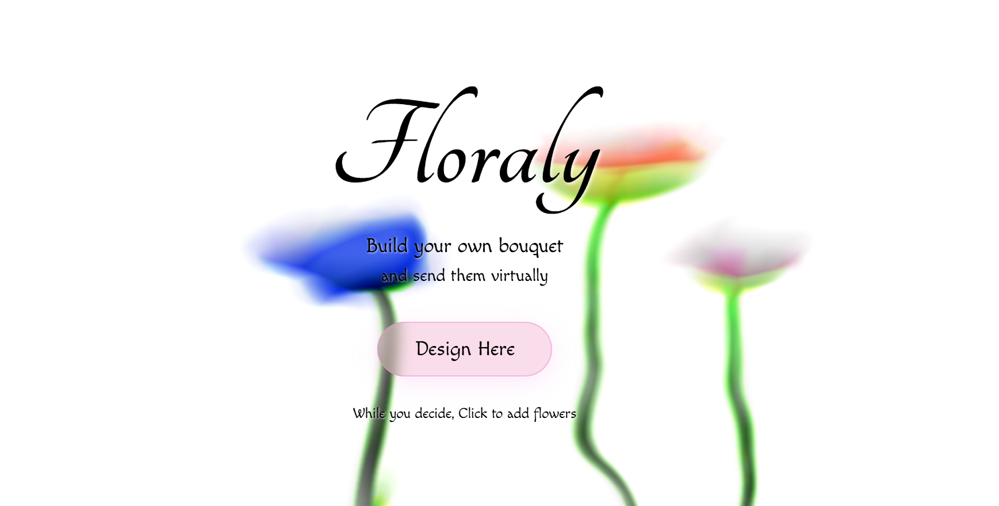

# 🌸 Floraly — Digital Bouquet Builder

> Build a beautiful digital bouquet and send it to someone you love.

**[🌷 Try it here](https://floraly.vercel.app/)**

---

## What it does

Floraly lets you pick flowers, arrange them by drag and drop, write a personal note, and share a unique link — all without any account or sign-up. Every bouquet lives in its own URL, so the person you send it to sees exactly what you made for them.

## How to use

1. **Pick your flowers** — choose as many as you want
2. **Arrange them** — drag and drop to style your bouquet
3. **Write your note** — add a message and sign it
4. **Share the link** — copy and send it to anyone, anywhere

## Built with

- HTML, CSS, Vanilla JavaScript
- No backend, no database — bouquet data is encoded in the URL itself

---

*a tool by [@susmitha](https://www.linkedin.com/in/susmithayeddula/)*